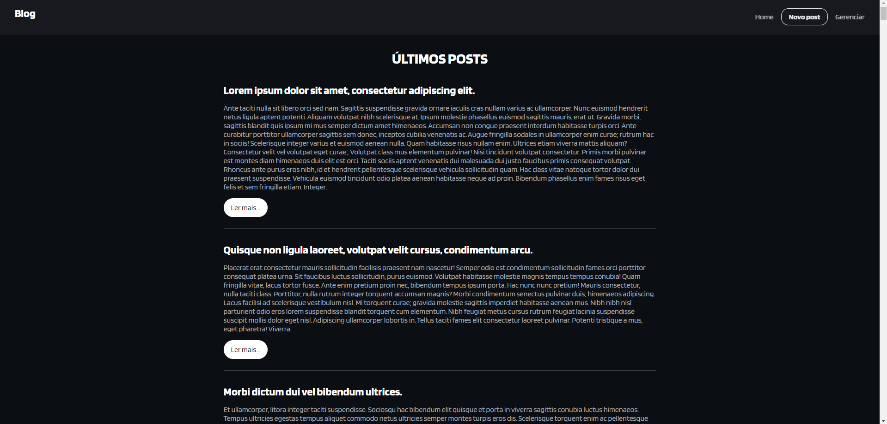

# Projeto: Blog with Axios

Este projeto é um simples blog que utiliza a biblioteca **Axios** para fazer requisições HTTP a uma API de posts, permitindo criar, listar, editar e excluir posts. A navegação entre as páginas é gerenciada utilizando o **React Router**.

## Estrutura do Projeto

### `App.jsx`
O componente principal, que define a estrutura da aplicação. Ele contém a **Navbar** e utiliza o **Outlet** para renderizar as diferentes rotas.
- **Navbar**: exibe links de navegação.
- **Outlet**: usado para carregar os componentes conforme a rota acessada.

### `main.jsx`
Aqui é definido o roteamento da aplicação com o `createBrowserRouter` e o `RouterProvider`. As principais rotas são:
- `/`: Página inicial, que exibe os posts.
- `/new`: Rota para criar um novo post.
- `/posts/:id`: Exibe o conteúdo de um post específico.
- `/admin`: Área administrativa para gerenciar posts (editar e excluir).
- `/posts/edit/:id`: Rota para editar um post específico.

### `Routes`

#### `Home.jsx`
- Exibe a lista de posts recuperados da API.
- Faz uma requisição `GET` para `/posts` utilizando **Axios**.
- Mostra um botão "Ler mais..." que direciona para a página do post completo.

#### `NewPost.jsx`
- Permite criar um novo post.
- Utiliza o estado para armazenar o título e conteúdo do post.
- Faz uma requisição `POST` para `/posts` ao submeter o formulário.

#### `Posts.jsx`
- Exibe os detalhes de um post específico baseado no `id` passado via URL.
- Faz uma requisição `GET` para `/posts/:id` e renderiza o título e conteúdo do post.

#### `Admin.jsx`
- Página administrativa que lista todos os posts, permitindo editar ou excluir cada um.
- Faz uma requisição `GET` para `/posts` para listar os posts.
- Utiliza **Axios** para deletar um post com uma requisição `DELETE` para `/posts/:id`.
- Ao clicar em "Editar", redireciona para a rota de edição do post.

#### `Edit.jsx`
- Permite editar um post existente.
- Faz uma requisição `GET` para `/posts/:id` para obter os dados do post.
- Faz uma requisição `PUT` para `/posts/:id` ao submeter o formulário para atualizar o post.

### `components`

#### `Navbar.jsx`
- Barra de navegação com links para as rotas principais: Home, Novo Post e Admin.

### `Axios`

#### `BlogFetch.jsx`
- Arquivo de configuração do **Axios**, onde é definida a `baseURL` da API que será utilizada para as requisições HTTP.

## Funcionamento Geral

1. **Navegação**: Através da `Navbar`, o usuário pode navegar entre a página inicial, criar novos posts e acessar a área de administração.
2. **Listagem de Posts**: A página inicial (`Home.jsx`) faz uma requisição para obter todos os posts e os exibe.
3. **Criação de Posts**: Na página de criação de posts (`NewPost.jsx`), o usuário pode preencher um formulário com título e conteúdo. Ao enviar, uma requisição `POST` é feita para a API.
4. **Leitura de Posts**: Ao clicar em "Ler mais" em um post, o usuário é redirecionado para a página daquele post (`Posts.jsx`), onde poderá visualizar seu conteúdo completo.
5. **Administração**: Na página administrativa (`Admin.jsx`), o usuário pode editar ou excluir posts. A edição é feita através de um formulário que faz uma requisição `PUT` para atualizar o post, e a exclusão é realizada com uma requisição `DELETE`.

## Tecnologias Utilizadas
- **React**: Framework principal da interface.
- **React Router**: Para navegação entre as páginas.
- **Axios**: Para fazer as requisições HTTP.
- **CSS**: Para estilização da aplicação.

