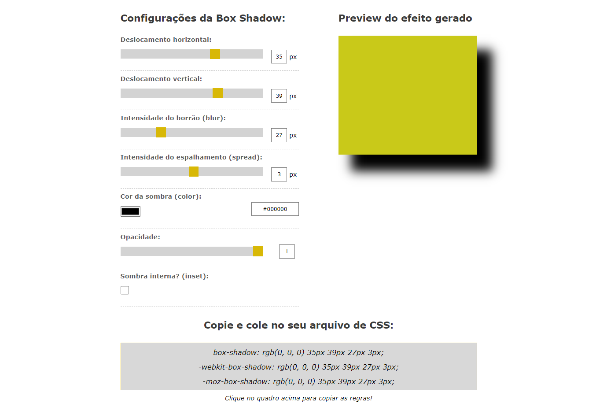

# Box Shadow Generator

#### Interface

Este projeto é uma ferramenta web que permite aos usuários criar e visualizar efeitos de sombra (box-shadow) em tempo real para elementos HTML. Ele é ideal para designers e desenvolvedores que desejam experimentar diferentes configurações de sombra sem precisar escrever manualmente o código CSS.

## Funcionamento

1. **Configuração da Sombra:**

   - O usuário ajusta os parâmetros da sombra usando controles deslizantes e campos de texto:
     - **Deslocamento Horizontal e Vertical:** Controla a posição da sombra em relação ao elemento.
     - **Intensidade do Borrão (Blur):** Define o nível de suavização da sombra.
     - **Intensidade do Espalhamento (Spread):** Ajusta a expansão ou contração da sombra.
     - **Cor da Sombra:** Permite escolher a cor da sombra usando um seletor de cor.
     - **Opacidade:** Define a transparência da sombra.
     - **Sombra Interna (Inset):** Alterna entre sombra externa e interna.

2. **Visualização em Tempo Real:**

   - As configurações ajustadas são aplicadas instantaneamente a uma caixa de visualização (`#box`) para que o usuário veja como a sombra ficará.

3. **Geração do Código CSS:**
   - Abaixo da visualização, o código CSS correspondente à sombra gerada é exibido em três formatos:
     - `box-shadow` (padrão)
     - `-webkit-box-shadow` (para navegadores WebKit)
     - `-moz-box-shadow` (para navegadores Firefox)
   - O usuário pode clicar no quadro para copiar o código gerado para a área de transferência.

## Componentes do Projeto

1. **index.html:**

   - Define a estrutura HTML da página, incluindo controles para ajustar os parâmetros da sombra, a área de visualização do efeito e a exibição do código CSS gerado.

2. **script.js:**

   - Contém a lógica para atualizar a visualização da sombra e gerar o código CSS correspondente.
   - Utiliza uma classe `BoxShadowGenerator` para gerenciar os parâmetros e atualizar a visualização e o código CSS quando os controles são ajustados.

3. **style.css:**
   - Define o estilo visual da página, incluindo a aparência dos controles, da caixa de visualização e da área de exibição do código CSS.
   - Garante que a interface seja clara e fácil de usar.

## Como Usar

1. Abra o arquivo `index.html` em um navegador web.
2. Ajuste os controles deslizantes e seletores para configurar a sombra desejada.
3. Observe a visualização da sombra aplicada na caixa.
4. Copie o código CSS exibido na área de regras clicando no quadro correspondente.

Este projeto oferece uma maneira intuitiva de experimentar diferentes configurações de sombra e obter o código necessário para aplicar o efeito em seus projetos web.
