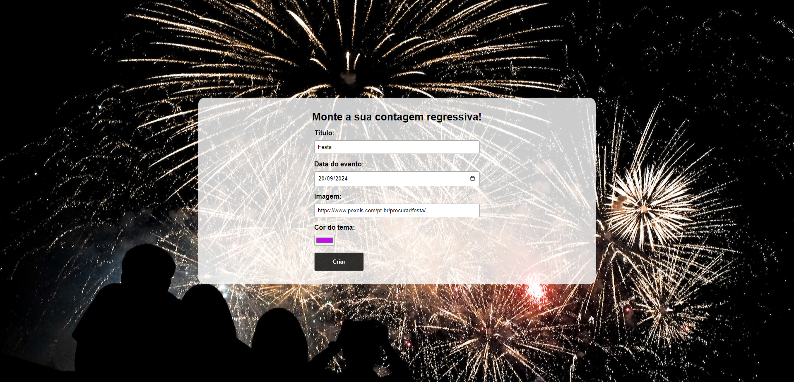

### **Estrutura Geral**
O **Countdown App** é uma aplicação que permite ao usuário criar uma contagem regressiva personalizada para um evento específico. O usuário define o título do evento, a data, uma imagem de fundo e a cor do tema. A aplicação então exibe a contagem regressiva com os dias, horas, minutos e segundos restantes até a data do evento.

### **Fluxo de Funcionamento**

1. **Tela Inicial (Home.jsx)**
   - Na tela inicial, o usuário pode preencher um formulário para configurar seu evento:
     - **Título**: Nome do evento.
     - **Data**: Data do evento para a contagem regressiva.
     - **Imagem**: URL de uma imagem que será usada como fundo da contagem.
     - **Cor do tema**: Cor que será usada para personalizar o texto e os números da contagem.
   - O formulário também valida se a data escolhida é futura; caso contrário, exibe uma mensagem de erro.
   - Ao submeter o formulário, o evento é salvo no contexto, e o usuário é redirecionado para a página de contagem regressiva.

2. **Contagem Regressiva (Countdown.jsx)**
   - A página de contagem regressiva exibe o tempo restante até o evento, usando os componentes **Title** (para exibir o nome do evento) e **Counter** (para exibir os dias, horas, minutos e segundos restantes).
   - Se o usuário tentar acessar a página de contagem regressiva sem definir um evento, ele será redirecionado de volta para a tela inicial.
   - A contagem é atualizada a cada segundo, usando o **hook** `useCountdown`, que calcula a diferença de tempo entre a data atual e a data do evento.

3. **Contexto (CountdownContext.jsx)**
   - O contexto é responsável por armazenar as informações do evento (título, data, imagem, cor) e disponibilizá-las para os componentes que necessitam dessas informações.
   - O **hook** `useCountdownContext` permite acessar e modificar os dados do contexto, como salvar o evento configurado pelo usuário.

### **Componentes Principais**
1. **App.jsx**
   - Define o estilo de fundo da aplicação com a imagem do evento ou uma imagem padrão, caso nenhuma tenha sido definida.
   - Usa o `Outlet` para renderizar as rotas da aplicação (tela inicial ou contagem regressiva).

2. **Home.jsx**
   - Exibe o formulário para o usuário configurar o evento. 
   - Valida se a data escolhida é válida (não pode ser uma data no passado).
   - Ao submeter, as informações do evento são armazenadas no contexto, e o usuário é redirecionado para a página de contagem regressiva.

3. **Countdown.jsx**
   - Exibe o título do evento e a contagem regressiva.
   - Usa o `useCountdown` para calcular os dias, horas, minutos e segundos restantes até o evento.
   - Renderiza os componentes **Title** e **Counter** com as informações personalizadas.

4. **Counter.jsx**
   - Exibe os números da contagem regressiva (dias, horas, minutos, segundos) com a cor personalizada pelo usuário.

5. **Title.jsx**
   - Exibe o título do evento com a cor personalizada escolhida pelo usuário.

### **Hooks e Lógica**
- **useCountdown.jsx**:
  - Calcula o tempo restante até o evento em dias, horas, minutos e segundos, atualizando esses valores a cada segundo com `setInterval`.
- **useCountdownContext.jsx**:
  - Fornece acesso ao contexto global onde os dados do evento são armazenados.

### **Estado Global**
O estado do evento é mantido no contexto, implementado com o **CountdownProvider**. Ele armazena as informações do evento atual e permite que outros componentes (como `Countdown.jsx` e `App.jsx`) acessem e usem esses dados.

### **Rotas**
- **"/" (Home.jsx)**: Tela inicial onde o usuário cria um novo evento.
- **"/countdown" (Countdown.jsx)**: Exibe a contagem regressiva para o evento configurado.

Esse fluxo garante que o usuário possa criar uma contagem regressiva personalizada e visualizá-la de forma dinâmica até a chegada do evento.
