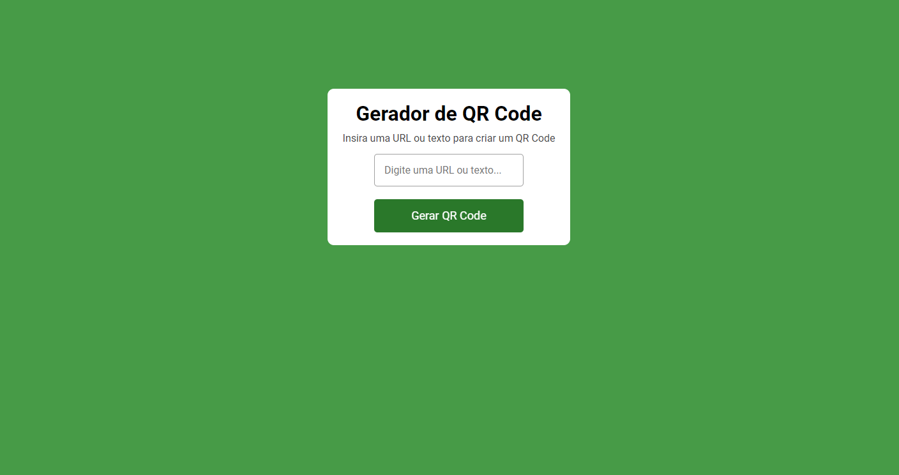

### **Estrutura Geral**

O **Gerador de QR Code** permite ao usuário gerar um QR Code com base em uma URL ou texto inserido. O QR Code é exibido logo após a geração e pode ser facilmente visualizado.

#### Interface



### **Fluxo de Funcionamento**

1. **Entrada de Dados (HTML - `index.html`)**

   - A página possui um campo de texto onde o usuário insere uma URL ou qualquer outro texto.
   - Um botão é responsável por acionar a geração do QR Code.
   - O QR Code gerado é exibido em uma imagem, que inicialmente está oculta.

2. **Geração do QR Code (JavaScript - `script.js`)**

   - Ao clicar no botão ou pressionar "Enter", o JavaScript captura o texto inserido e envia uma solicitação para gerar o QR Code.
   - A API `https://api.qrserver.com/v1/create-qr-code/` é usada para gerar a imagem do QR Code, com o texto fornecido como parâmetro.
   - Após a geração, o QR Code é exibido na interface.

3. **Exibição do QR Code**

   - O QR Code gerado é exibido dentro de um container que estava inicialmente oculto. Esse container é mostrado assim que a imagem do QR Code é carregada.

4. **Verificação de Campos Vazios**
   - Se o campo de texto estiver vazio e o botão for clicado, nada acontece, garantindo que não seja gerado um QR Code vazio.

### **Componentes Principais**

1. **HTML (`index.html`)**

   - Define a estrutura básica da página, incluindo um título, um campo de entrada de texto e um botão.
   - O container que exibirá o QR Code inicialmente está oculto (`display-none`).

2. **CSS (`style.css`)**

   - Estiliza a página com um design limpo e simples:
     - O fundo da página tem uma cor verde, e o conteúdo é centralizado na tela.
     - A área de geração do QR Code é destacada com um fundo branco e bordas arredondadas, mantendo uma aparência moderna.
     - O botão "Gerar QR Code" muda de opacidade quando o cursor passa por ele, criando um efeito de feedback visual.
   - **Animação e Transições**:
     - O container que exibe o QR Code tem uma transição suave quando o QR Code é gerado, proporcionando uma experiência visual agradável.

3. **JavaScript (`script.js`)**
   - Controla toda a lógica para a geração do QR Code:
     - Captura o valor do campo de entrada.
     - Envia esse valor para a API que gera o QR Code, e exibe o código gerado.
     - O botão exibe "Gerando código..." enquanto o QR Code está sendo processado.
     - Se o campo de texto estiver vazio, a geração do QR Code não é acionada.

### **Lógica de Geração**

- **Geração do QR Code**: A URL ou texto fornecido pelo usuário é enviado para a API `qrserver`, que retorna a imagem do QR Code. A imagem é então exibida na página.

  Exemplo de URL de solicitação:

  ```
  https://api.qrserver.com/v1/create-qr-code/?size=200x200&data=SEU_TEXTO_AQUI
  ```

### **Interação com o Usuário**

- O usuário interage diretamente com:

  1. **Campo de Texto**: Onde insere a URL ou o texto que deseja transformar em QR Code.
  2. **Botão "Gerar QR Code"**: Ao ser clicado, aciona a geração do QR Code com base no texto inserido.
  3. **QR Code Gerado**: Aparece logo abaixo do campo de texto, caso uma URL ou texto tenha sido inserido corretamente.

- Se o campo de entrada estiver vazio, o QR Code não será gerado, evitando comportamentos inesperados.

### **Conclusão**

Este **Gerador de QR Code** é uma aplicação simples e eficaz para gerar QR Codes a partir de URLs ou textos inseridos pelo usuário. Com uma interface clara e fácil de usar, ele garante uma experiência prática e intuitiva, utilizando **HTML, CSS e JavaScript** para realizar o processo.
