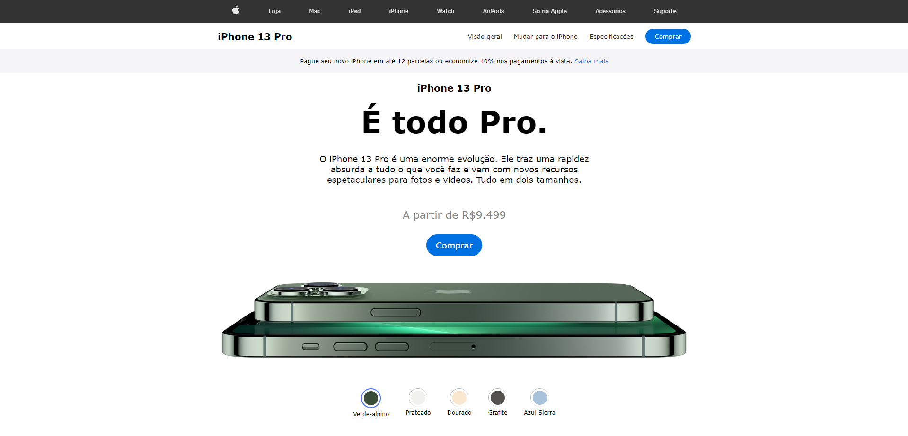

### 1. **Interface (index.html)**:

- A página simula a página oficial do iPhone 13, incluindo um **header** com navegação semelhante à da Apple.
- O título principal apresenta o **iPhone 13 Pro** e oferece informações de destaque sobre o produto, como preço e especificações.
- O usuário pode selecionar diferentes cores do iPhone 13 Pro (Verde-alpino, Prateado, Dourado, Grafite e Azul-Sierra) através de uma **lista interativa** de botões com círculos coloridos que correspondem às cores disponíveis.
- A cor selecionada será exibida com uma borda azul ao redor do círculo correspondente, e a imagem do iPhone mudará para a versão na cor selecionada.
- Um link de **compra** está presente, simulando a opção de compra do produto.

### 2. **Lógica (script.js)**:

- As interações ocorrem via eventos de clique associados a botões de cores, onde a imagem do iPhone muda para a cor selecionada.
- **Seleção de cor**:
  - Cada botão (representado por um `<li>`) possui uma classe correspondente à cor do iPhone (como `green`, `silver`, `gold`, `graphite` e `blue`).
  - Ao clicar em um botão, a classe `border-blue` é adicionada ao círculo para destacar a seleção, e a imagem do iPhone correspondente é carregada após uma transição suave (alteração de opacidade).
  - A função que troca a imagem espera 200ms para completar a transição, criando um efeito de "fade" (desaparecimento e reaparecimento suave da imagem).
- **Estilização das bordas**:
  - A classe `border-blue` destaca o círculo ao redor da cor selecionada, enquanto as demais cores mantêm uma borda preta (`border-black`).

### 3. **Estilo (style.css)**:

- O design da página segue um estilo moderno, minimalista e com inspiração clara no visual da **Apple**, utilizando cores neutras e layouts centrados.
- **Header**:
  - Barra de navegação superior em fundo preto com links brancos, simulando o layout de navegação da Apple.
- **Main**:
  - Texto de destaque no centro da página com a descrição do iPhone 13 Pro e seu preço.
  - O botão de **compra** é destacado com um fundo azul similar ao padrão da Apple.
- **Seção de cores**:
  - Círculos de cores são exibidos abaixo da imagem do iPhone, permitindo que o usuário veja diferentes opções de cores.
  - Cada círculo é estilizado com uma borda branca, e o círculo selecionado recebe uma borda azul, enquanto os demais permanecem com borda preta.
- **Responsividade**:
  - O site é adaptável para diferentes tamanhos de tela (desktop, tablet, smartphone) com ajustes no layout, como o redimensionamento das imagens e textos, para garantir uma boa experiência em dispositivos menores.

### Resumo do Fluxo:

1. O usuário acessa a página e vê o iPhone 13 Pro com descrição e preço.
2. Ao clicar em um círculo de cor, a imagem do iPhone muda para a cor correspondente com uma animação suave.
3. O círculo selecionado é destacado com uma borda azul.
4. O usuário pode navegar pelo conteúdo e visualizar as opções de compra do iPhone.
