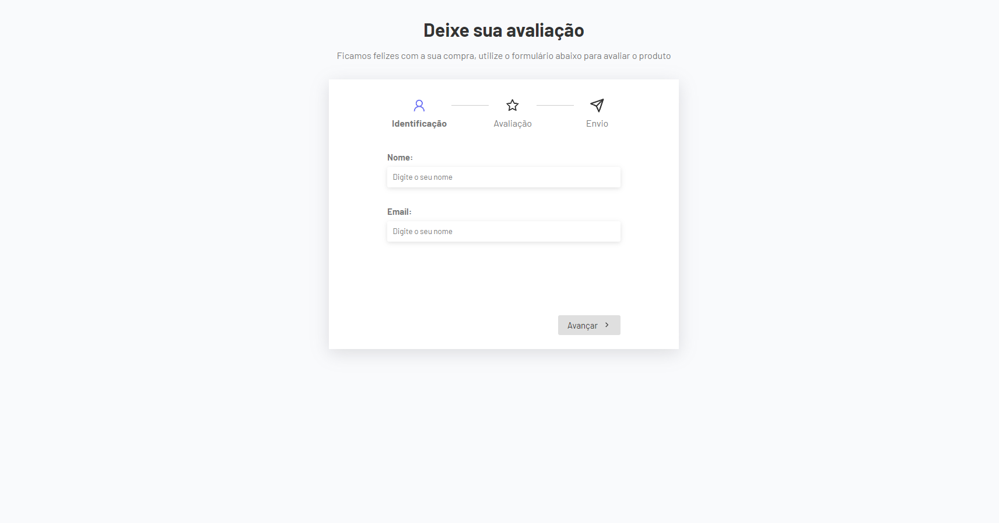

# Multistep Form com TypeScript

#### Interface



Este projeto é um formulário multi-etapas desenvolvido em **React** com **TypeScript**. O objetivo do formulário é permitir que os usuários façam uma avaliação de um produto, passando por várias etapas de coleta de informações, desde identificação até a conclusão do envio.

## Funcionalidades

- Formulário multi-etapas com transições entre as etapas.
- Validação dos campos do formulário.
- Ícones e design intuitivo para melhorar a experiência do usuário.
- Resumo final da avaliação antes do envio.
- Utilização de hooks personalizados para navegação entre etapas.

## Como Funciona

O formulário possui 3 etapas principais:

1. **Identificação**: Coleta do nome e e-mail do usuário.
2. **Avaliação**: O usuário seleciona a sua satisfação com o produto e adiciona um comentário.
3. **Resumo e Envio**: O resumo da avaliação é apresentado ao usuário antes de finalizar o envio.

Navegação entre etapas:

- Botão "Voltar" para retornar à etapa anterior.
- Botão "Avançar" para ir à próxima etapa, com validação dos campos.
- Na última etapa, o botão "Enviar" aparece para finalizar a avaliação.

## Tecnologias Utilizadas

- **React**: Biblioteca JavaScript para criação da interface de usuário.
- **TypeScript**: Superset de JavaScript para adicionar tipagem estática ao projeto.
- **React Hooks**: Utilização de hooks personalizados para controle das etapas do formulário.
- **React Icons**: Biblioteca de ícones usada para melhorar a interface.
- **CSS Modules**: Estilização dos componentes de maneira modular.

## Como Executar o Projeto

### Pré-requisitos

- Node.js instalado
- Gerenciador de pacotes `npm` ou `yarn`

### Passos para execução

1. Clone o repositório:
   ```bash
   git clone https://github.com/seu-usuario/multistep-form.git
   ```
2. Instale as dependências:
   ```bash
   npm install
   ```
   ou
   ```bash
   yarn install
   ```
3. Execute o projeto:
   ```bash
   npm start
   ```
   ou
   ```bash
   yarn start
   ```

O projeto estará rodando em `http://localhost:3000`.

## Estrutura do Projeto

- **App.tsx**: Componente principal do projeto, responsável por gerenciar as etapas e os dados do formulário.
- **hooks/useForm.tsx**: Hook personalizado para controlar a navegação entre as etapas do formulário.
- **components/UserForm.tsx**: Componente responsável pela coleta de dados de identificação (nome e e-mail).
- **components/ReviewForm.tsx**: Componente onde o usuário avalia o produto e insere um comentário.
- **components/Thanks.tsx**: Componente final que exibe o resumo da avaliação antes do envio.
- **components/Steps.tsx**: Componente que exibe o progresso das etapas do formulário.

## Contribuições

Contribuições são bem-vindas! Sinta-se à vontade para abrir issues e pull requests.

## Licença

Este projeto está licenciado sob a licença MIT. Consulte o arquivo [LICENSE](./LICENSE) para mais detalhes.
