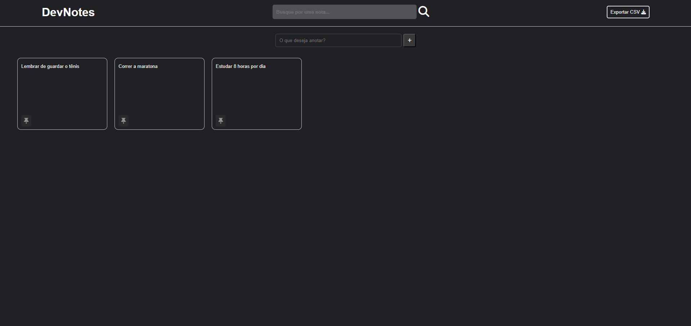

# DevNotes

#### Interface

DevNotes é uma aplicação web simples de gerenciamento de notas, permitindo criar, buscar, fixar, duplicar e remover notas. Além disso, é possível exportar as notas para um arquivo CSV. A interface é dinâmica e armazena as informações localmente no navegador.

## Funcionalidades:

- **Criação de Notas**: Insira um texto e adicione uma nova nota clicando no botão ou pressionando "Enter".
- **Busca de Notas**: Filtre as notas digitando na barra de busca, com suporte a maiúsculas e minúsculas.
- **Fixar Notas**: Notas podem ser fixadas no topo, destacando-as visualmente.
- **Duplicação de Notas**: É possível duplicar qualquer nota criada.
- **Remoção de Notas**: Notas podem ser removidas facilmente através de um botão de exclusão.
- **Exportar para CSV**: As notas podem ser exportadas para um arquivo CSV para ser baixado.

## Estrutura do Projeto:

- `index.html`: Estrutura HTML da página, contém os elementos principais da interface do DevNotes como header, campo de busca, input de notas, e área de visualização das notas.
- `css/styles.css`: Folha de estilo que define o layout e o design da aplicação, incluindo cores, tamanhos, espaçamentos, e animações.

- `js/scripts.js`: Script que gerencia a interação do usuário com a aplicação. Responsável pela criação, busca, fixação, duplicação, exclusão de notas, e também pelo gerenciamento do armazenamento local.

## Como Executar:

1. Clone o repositório.
2. Abra o arquivo `index.html` em qualquer navegador.

---

# devNotes

### **index.html**

Arquivo principal que estrutura a interface do usuário. Ele inclui:

- Header com campo de busca.
- Seção para exportar notas.
- Campo de input para adicionar novas notas.
- Área principal que exibe as notas.

### **script.js**

Este script gerencia as principais funcionalidades da aplicação:

- **Adicionar notas**: Cria uma nova caixa de nota com base no valor inserido.
- **Busca de notas**: Filtra notas existentes com base no termo de busca.
- **Fixar/Desafixar notas**: Permite que o usuário fixe uma nota no topo da lista.
- **Duplicar nota**: Cria uma cópia exata de uma nota existente.
- **Excluir nota**: Remove permanentemente uma nota.
- **Armazenamento local**: Notas são salvas no `localStorage`, garantindo persistência entre sessões.

### **style.css**

Define o layout e o tema da aplicação:

- Fundo escuro com contrastes claros.
- Elementos minimalistas e responsivos.
