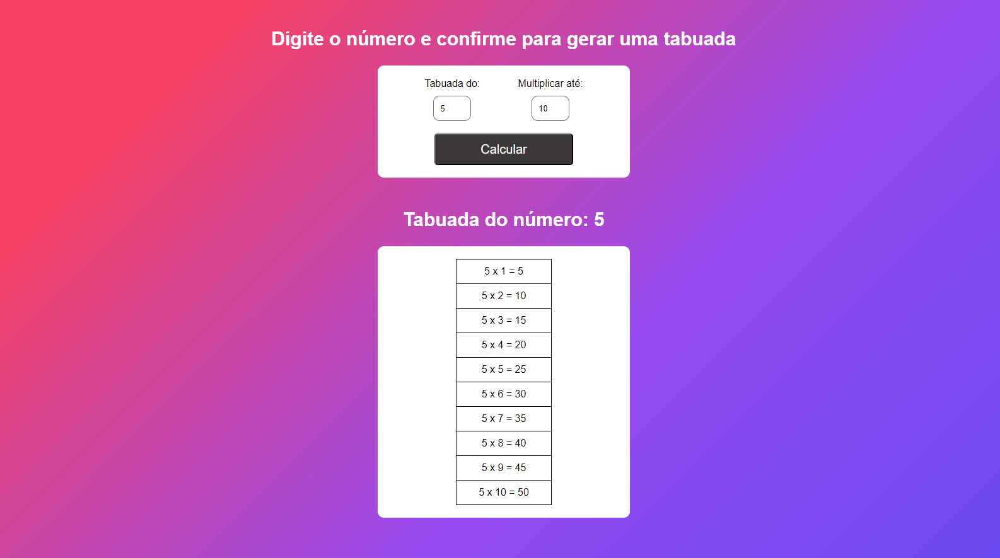

# Projeto Tabuada de Multiplicação

#### Interface

Este projeto é uma aplicação web que permite ao usuário calcular e visualizar a tabuada de multiplicação de um número específico. Abaixo, explicamos como o projeto funciona e suas principais componentes.

## Funcionamento

1. **Entrada de Dados:**

   - O usuário deve inserir um número para a tabuada e o número até o qual deseja multiplicar.
   - O campo "Tabuada do:" aceita o número que será usado como multiplicador.
   - O campo "Multiplicar até:" define até qual número a tabuada será calculada.

2. **Processo de Cálculo:**

   - Após preencher os campos, o usuário clica no botão "Calcular".
   - O JavaScript verifica se ambos os campos foram preenchidos corretamente e exibe mensagens de alerta caso haja algum problema (por exemplo, se um campo estiver vazio ou se o multiplicador for menor ou igual a zero).

3. **Geração da Tabela:**

   - Se os dados estiverem corretos, a aplicação calcula a tabuada e a exibe em uma tabela HTML.
   - A tabela é preenchida com resultados da multiplicação, por exemplo, "5 x 1 = 5", "5 x 2 = 10", e assim por diante, até o número especificado.

4. **Exibição dos Resultados:**
   - A tabela é exibida na página, substituindo o texto de instrução inicial.
   - Após o cálculo, os campos de entrada são limpos para uma nova operação.

## Componentes do Projeto

1. **index.html:**

   - Contém a estrutura HTML da página, incluindo campos de entrada, botão de cálculo e área para exibição dos resultados.

2. **script.js:**

   - Gerencia a lógica de cálculo e atualização da tabela com os resultados da multiplicação.
   - Também lida com a validação dos dados de entrada e exibe alertas quando necessário.

3. **style.css:**
   - Define o estilo visual da página, incluindo a formatação de campos de entrada, botões e tabela de resultados.
   - Garante que a interface seja amigável e esteticamente agradável.

## Como Usar

1. Abra o arquivo `index.html` em um navegador web.
2. Preencha os campos "Tabuada do:" e "Multiplicar até:" com os números desejados.
3. Clique no botão "Calcular" para gerar a tabuada.
4. Veja os resultados exibidos em uma tabela abaixo do botão.

Este projeto é uma maneira prática de visualizar as tabuadas de multiplicação e pode ser facilmente modificado para atender a diferentes necessidades ou expandido com mais funcionalidades.
