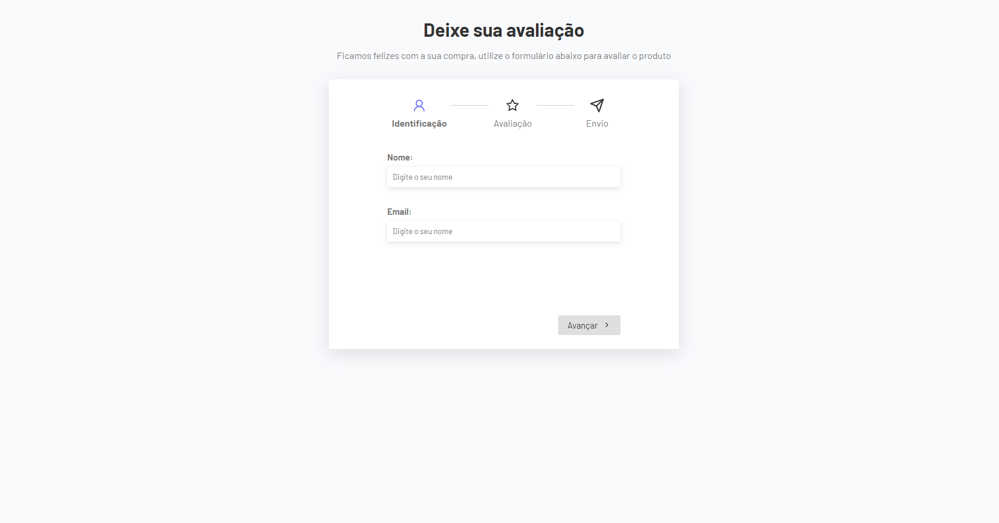

# Multi Step Form



Este projeto é um formulário multi-step, criado para coletar informações do usuário, realizar uma avaliação de um produto e finalizar com uma mensagem de agradecimento e um resumo. Cada etapa é apresentada de forma dinâmica, onde o usuário pode avançar e voltar entre os passos até concluir o processo. Abaixo, explico como cada parte do código funciona.

## Estrutura do Projeto

### 1. **App.jsx**
Este é o arquivo principal do projeto que gerencia as diferentes etapas do formulário e define o fluxo de navegação entre elas.

- **State Inicial (`formTemplate`)**: Define os campos que serão preenchidos no formulário (nome, email, avaliação e comentário).
  
- **Função `updateFieldHandler`**: Atualiza os dados do formulário quando o usuário preenche os campos. É chamada em cada etapa para capturar os valores inseridos.

- **Componentes do Formulário**: São divididos em três partes:
  - **UserForm**: Coleta as informações do usuário (nome e email).
  - **ReviewForm**: Permite que o usuário faça a avaliação e escreva um comentário.
  - **Thanks**: Exibe uma mensagem de agradecimento e um resumo da avaliação.

- **Hooks (`useForm`)**: Controla a navegação entre os componentes do formulário e o estado atual da etapa. Determina quando o usuário está na última ou primeira etapa.

- **Navegação**: Botões "Avançar" e "Voltar" são controlados dinamicamente. O botão de envio aparece apenas na última etapa.

### 2. **useForm.jsx**
Este hook personalizado controla o fluxo das etapas do formulário.

- **`currentStep`**: Estado que armazena a etapa atual do formulário.
- **`changeStep`**: Função que permite avançar ou voltar nas etapas do formulário.
- **`isFirstStep` e `isLastStep`**: Variáveis booleanas que identificam se o usuário está na primeira ou última etapa.

### 3. **Componentes Individuais**

#### **UserForm.jsx**
Este componente renderiza o formulário de identificação do usuário. Ele contém dois campos:
- **Nome**: Onde o usuário insere seu nome.
- **Email**: Onde o usuário insere seu email.

#### **ReviewForm.jsx**
Neste componente, o usuário faz a avaliação do produto. Ele pode escolher entre quatro opções de satisfação (muito satisfeito, satisfeito, neutro ou insatisfeito), e adicionar um comentário.
- Os ícones de emoji são usados para ilustrar as opções de avaliação.

#### **Thanks.jsx**
Ao final do processo, este componente mostra uma mensagem de agradecimento e o resumo da avaliação.
- Exibe o nome do usuário, o nível de satisfação (com um emoji correspondente) e o comentário.

### 4. **Steps.jsx**
Este componente exibe visualmente o progresso do usuário entre as etapas. Cada etapa tem um ícone representando a ação:
- **Identificação**: Ícone de usuário.
- **Avaliação**: Ícone de estrela.
- **Envio**: Ícone de envio.

A etapa atual é destacada com uma classe `active`.

### Fluxo Completo do Formulário:
1. **Identificação**: O usuário insere seu nome e email.
2. **Avaliação**: O usuário seleciona sua satisfação e pode adicionar um comentário.
3. **Conclusão**: O resumo da avaliação é mostrado e o formulário é enviado.

## Tecnologias Utilizadas:
- **React**: Para a construção dos componentes e gerenciamento de estados.
- **React Hooks**: Usados para controlar o fluxo entre as etapas do formulário.
- **CSS**: Para estilização do formulário e dos ícones.

## Instruções de Uso:
1. Clone o repositório.
2. Instale as dependências:
   ```bash
   npm install
   ```
3. Execute o projeto:
   ```bash
   npm start
   ```
4. Preencha o formulário, avance pelas etapas e veja o resumo final.

Este projeto é uma excelente introdução ao conceito de formulários multi-step e gestão de estados em React, sendo uma forma prática de aplicar o uso de hooks e componentes dinâmicos.
